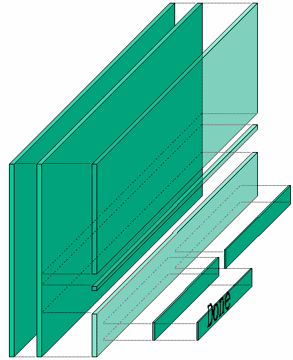

************************************
Hierarchical composition of a window
************************************

Interfaces in GtkAda are built in layers, as in Motif.  For instance, a typical
dialog is basically a Gtk_Window, that in turn contains a Gtk_Box, itself
divided into two boxes and a Gtk_Separator, and so on.

Altough this may seem more complicated than setting absolute positions for
children, this is the simplest way to automatically handle the resizing of
windows. Each container that creates a layer knows how it should behave when it
is resized, and how it should move its children.  Thus almost everything is
handled automatically, and you don't have to do anything to support resizing.

If you really insist on moving the children to a specific position, look at the
`Gtk_Fixed` widget and its demo in :file:`testgtk/`. But you really should not
use this container, since you will then have to do everything by hand.

All the containers are demonstrated in :file:`testgtk/`, in the GtkAda
distribution. This should help you understand all the parameters associated
with the containers. It is very important to master these containers, since
using the appropriate containers will make building interfaces a lot easier.

If you look at the widget hierarchy (:ref:`Widgets_Hierarchy`), you can see
that a Gtk_Window inherits from Gtk_Bin, and thus can have only one child. In
most cases, the child of a Gtk_Window will thus be a Gtk_Box, which can have
any number of children.

Some widgets in GtkAda itself are built using this strategy, from the very
basic `Gtk_Button` to the more advanced `Gtk_File_Selection`.

For example, by default a Gtk_Button contains a Gtk_Label, which displays the
text of the button (like 'OK' or 'Cancel').

However, it is easy to put a pixmap in a button instead. When you create the
button, do not specify any label. Thus, no child will be added, and you can
give it your own. See :file:`testgtk/create_pixmap.adb` for an example on how
to do that.

